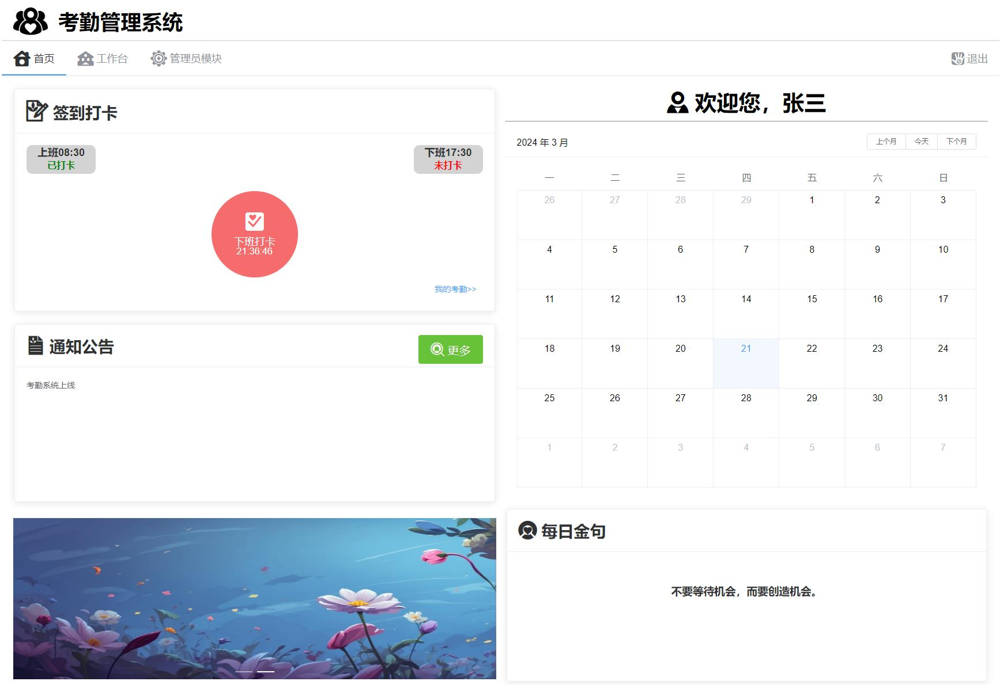
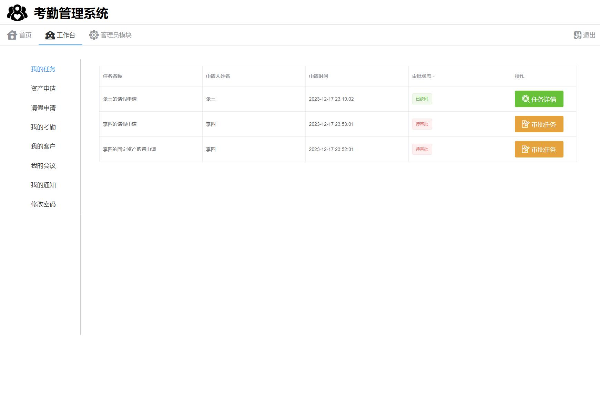
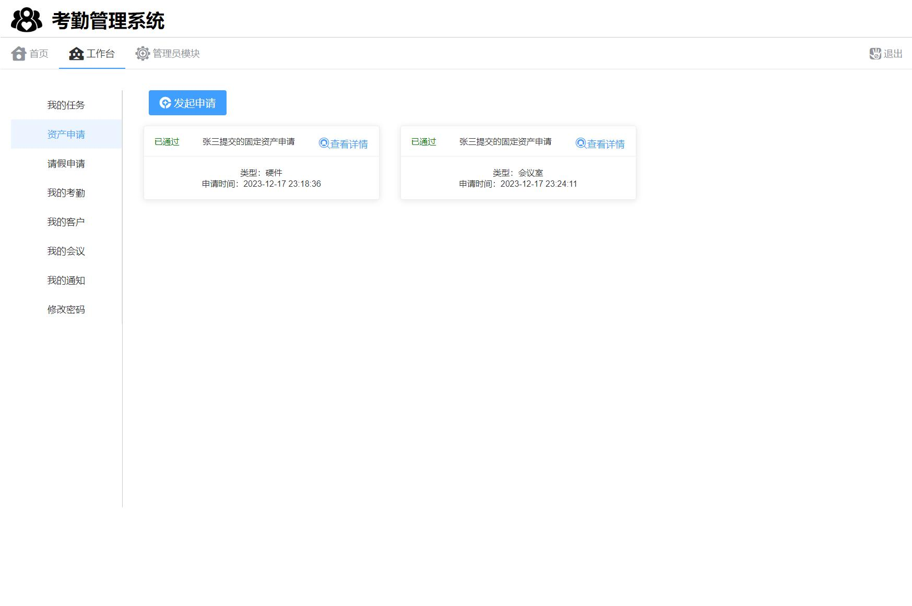
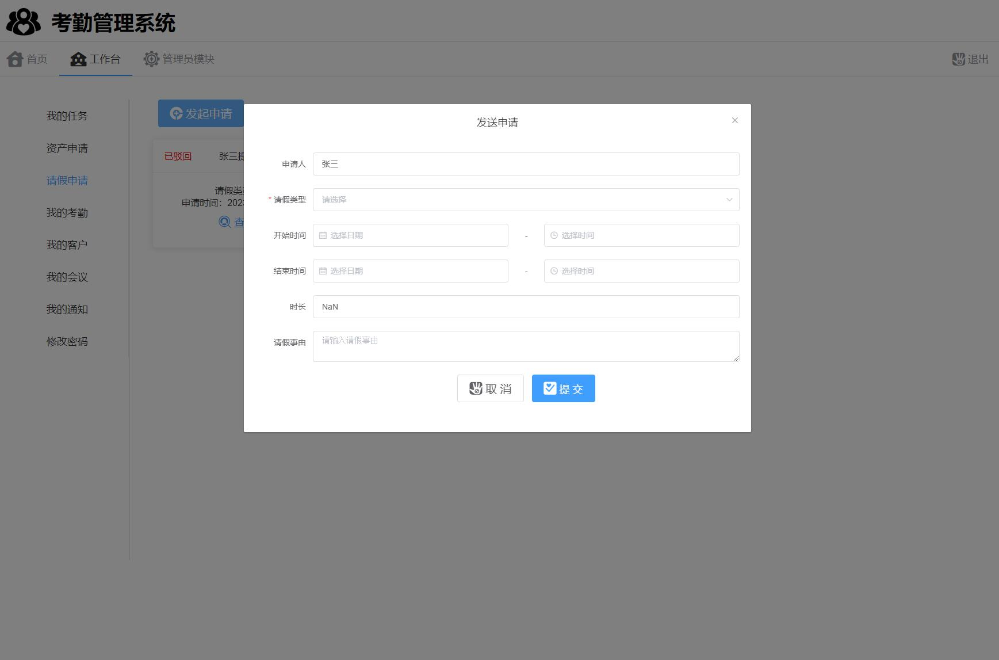
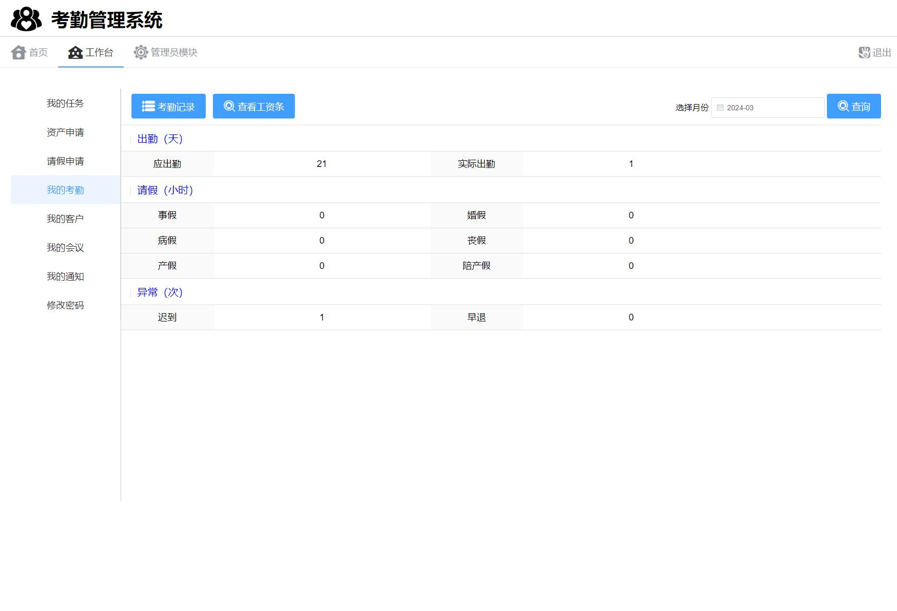
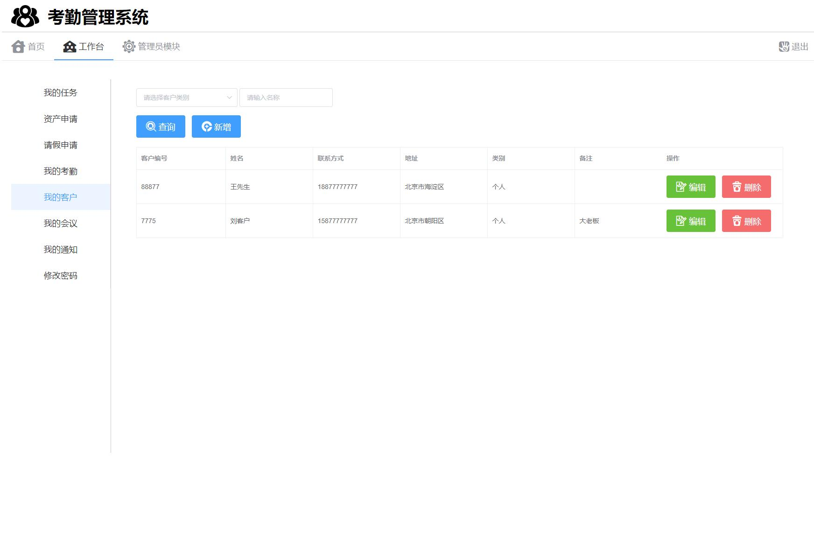
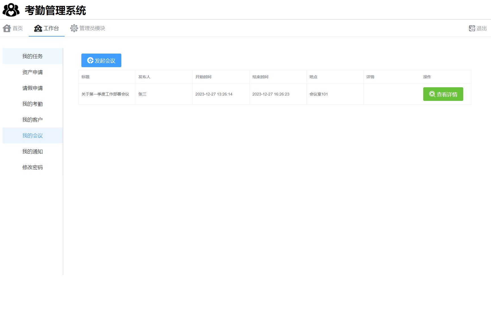
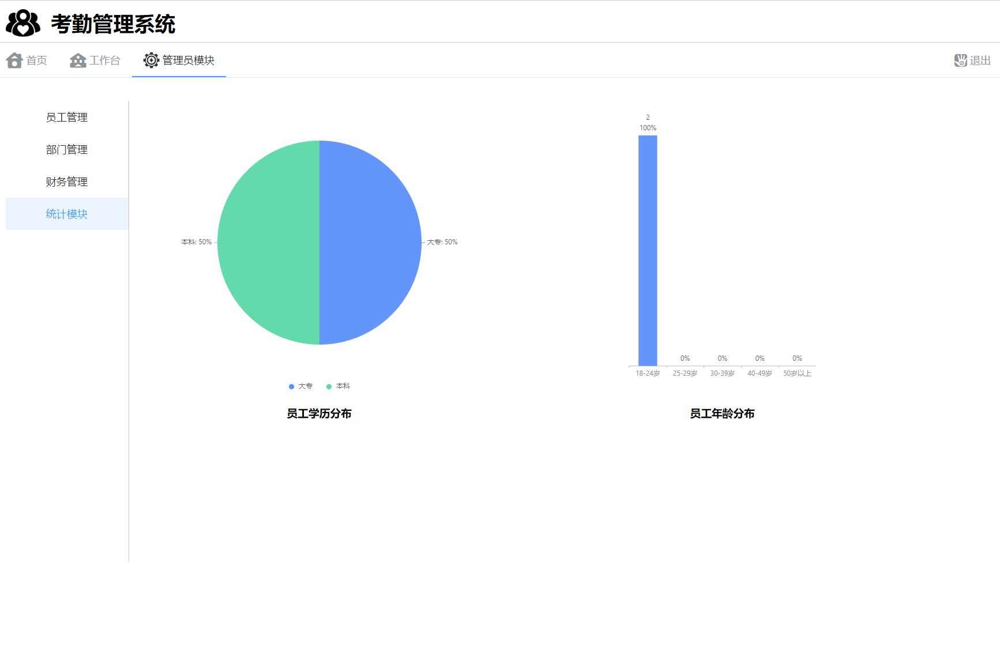
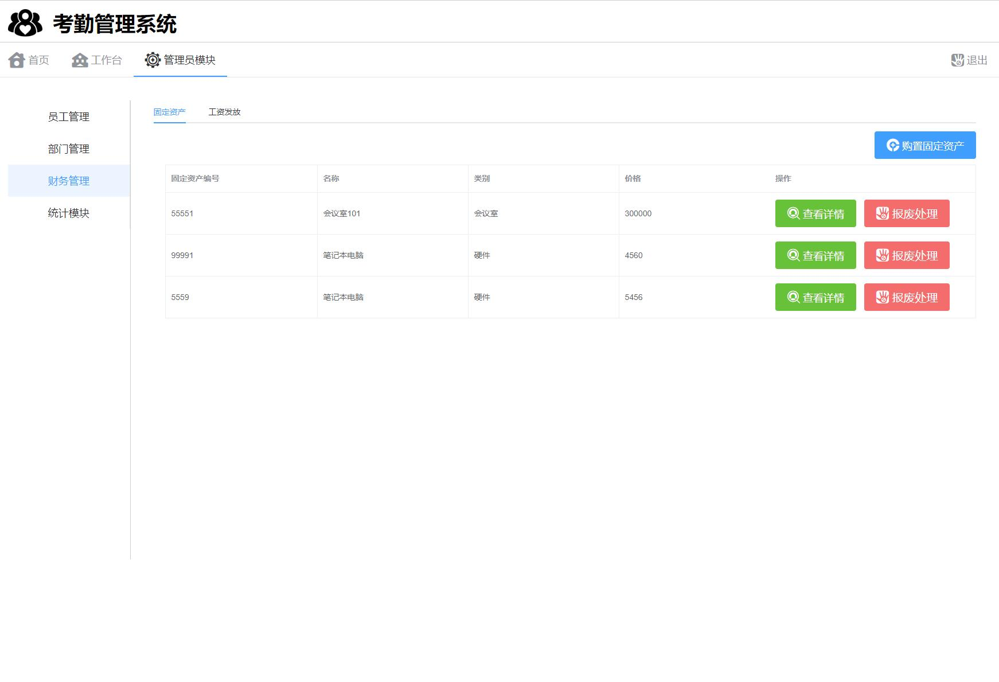
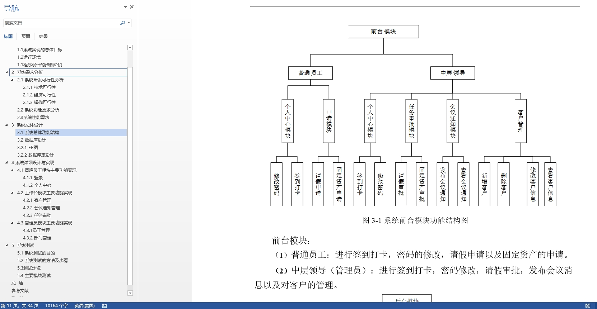

# 1.项目介绍
- 系统角色：管理员、员工
- 功能模块：员工管理、部门管理、财务管理、统计模块、资产申请、请假申请、考勤签到、我的客户、我的会议、我的通知等
- 技术选型：SpringBoot，Vue等
- 测试环境：idea2024，jdk1.8，mysql5.7，maven3，Node18.16.1
# 2.项目部署
## 2.1 后端部署
- 创建数据库，导入sql文件
- idea打开目录AttendanceManagerApi - idea，根据本地数据库环境修改src/main/resources/application.yml 3-6行
- 启动项目 src/main/java/com/StartApplication.java
## 2.2 管理web
- idea（安装vue.js插件）或者webstorm、vscode等ide工具打开项目AttendanceManagerVue
- 进入终端，输入 npm  install安装依赖（下载失败自行配置阿里的镜像加速）
- 启动项目 npm run serve
- 打开终端的地址，输入账号密码：管理员（10001、123456）、普通员工（10002,123456）
# 3.项目部分截图

# 4.获取方式
[戳我查看](https://gitee.com/aven999/mall)
